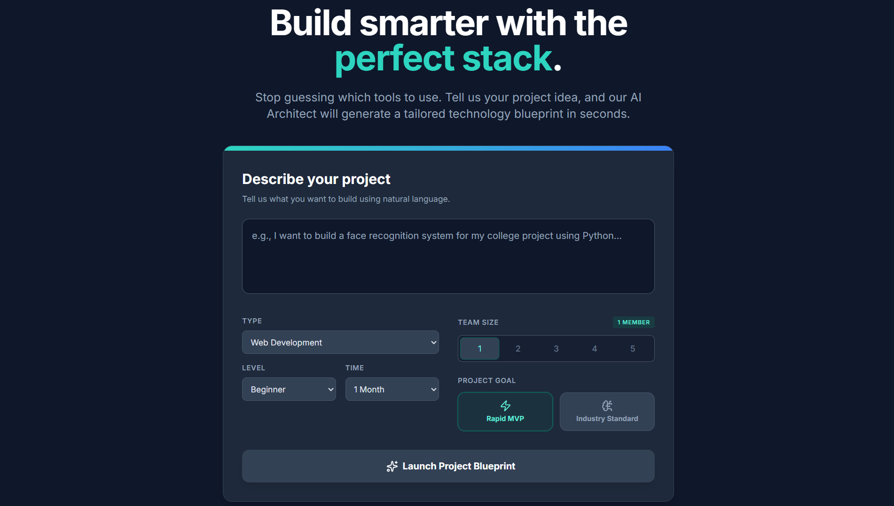
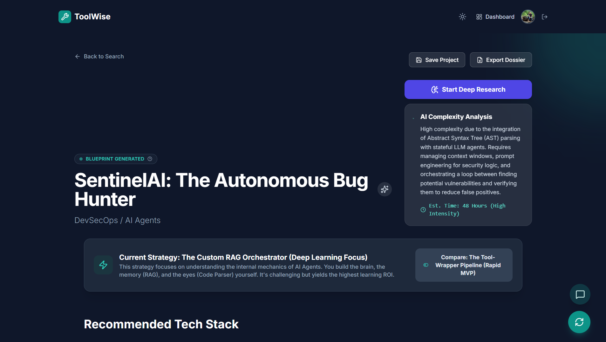
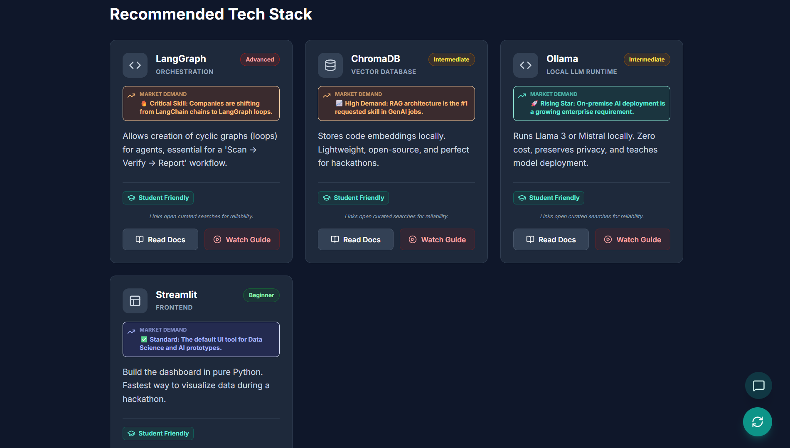
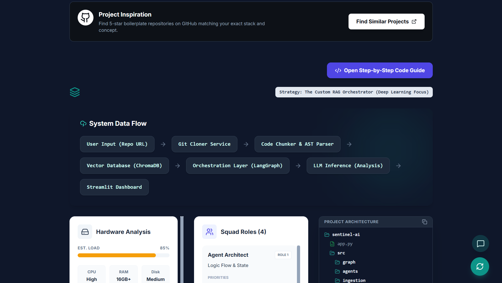
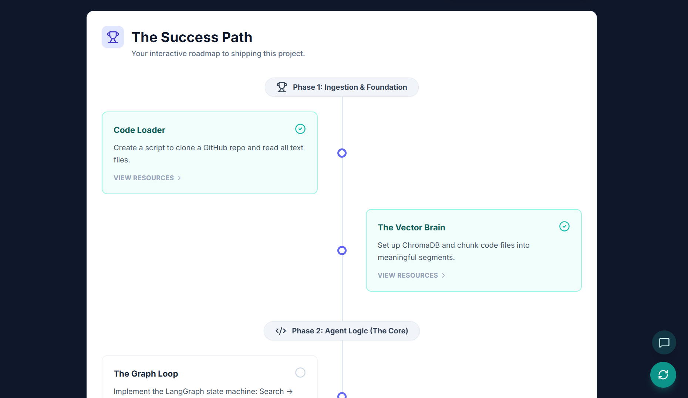
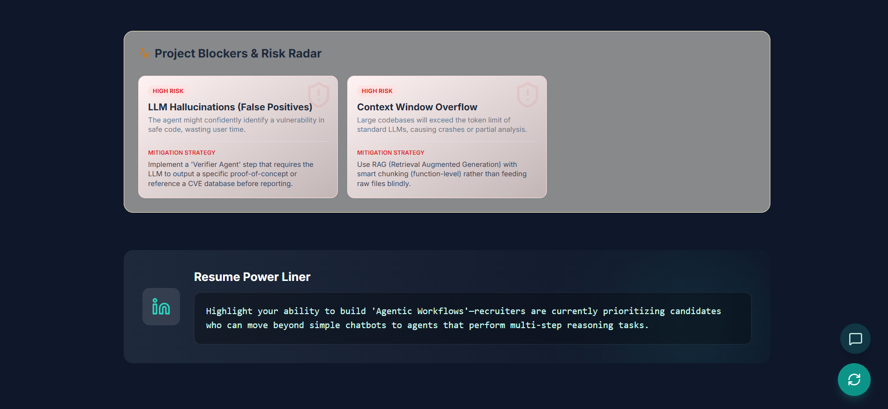
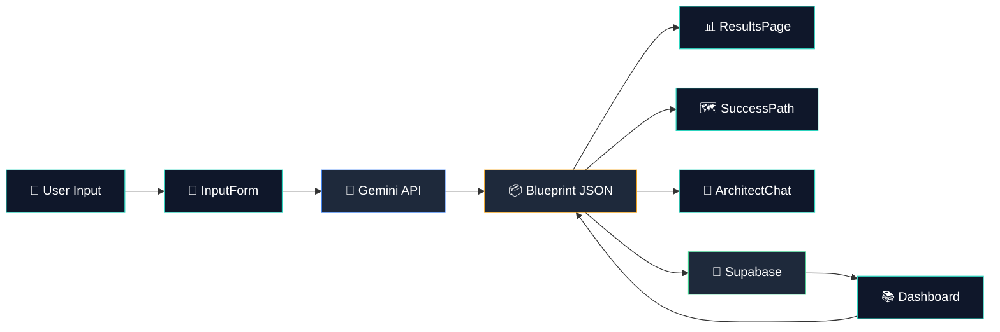
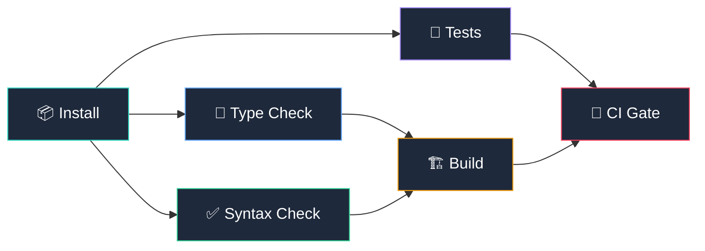

<div align="center">

# 🛠️ ToolWise

### **AI-Powered Project Blueprint Architect**

_From **"I have an idea"** to **"Here's the full blueprint"** — in seconds._

<br/>

[](https://react.dev)
[](https://www.typescriptlang.org/)
[](https://vitejs.dev/)
[](https://ai.google.dev/)
[](https://supabase.com/)
[](#-continuous-integration)
[](LICENSE)

<br/>

> **ToolWise** is an intelligent platform for developers & students that generates
> comprehensive technical blueprints, dual-strategy comparisons, interactive roadmaps,
> and production-ready starter kits — all powered by Google Gemini AI.

<br/>

[✨ Features](#-features) •
[📸 Screenshots](#-screenshots) •
[🏗️ Architecture](#%EF%B8%8F-architecture) •
[⚡ Quick Start](#-quick-start) •
[🧭 Walkthrough](#-walkthrough) •
[🧪 CI](#-continuous-integration) •
[🤝 Contributing](#-contributing)

</div>

<br/>

---

<br/>

## 📸 Screenshots

<div align="center">

### 🏠 Landing Page — Describe Your Idea



<sub>Tell ToolWise what you want to build in natural language. Choose your level, time, team size, and project goal — then hit <b>Launch Project Blueprint</b>.</sub>

<br/><br/>

### 📊 Blueprint Dashboard — Full Project Overview



<sub>Get an instant AI-generated blueprint with project name, domain, complexity analysis, estimated duration, and dual strategy comparison. Save to cloud or export as PDF.</sub>

<br/><br/>

### 🧩 Tech Stack Cards — With Market Insights



<sub>Every recommended tool comes with difficulty badges, market demand insights, student-friendly indicators, and direct links to docs and video tutorials.</sub>

<br/><br/>

### 🔀 Data Flow & Architecture



<sub>Visualize your system's data journey, hardware requirements, team squad roles, and full project folder structure — all generated from your description.</sub>

<br/><br/>

### 🗺️ Interactive Success Path



<sub>A phase-by-phase roadmap from foundation to deployment. Click nodes to see concepts, curated resources, and mark progress. Your journey is auto-saved.</sub>

<br/><br/>

### ⚠️ Risk Radar & Resume Power-Liner



<sub>Identify project blockers with severity levels and AI-generated mitigation strategies. Plus, get a tailored resume one-liner for your portfolio or LinkedIn.</sub>

</div>

<br/>

---

<br/>

## ✨ Features

<table>
<tr>
<td width="50%">

### 🧠 AI Blueprint Generation
Powered by **Google Gemini AI** — describe your project in plain English and receive a full technical architecture in seconds. Structured JSON output ensures precision every time.

</td>
<td width="50%">

### ⚔️ Dual Strategy Comparison
Every blueprint includes two approaches:
- 🏢 **Industry Standard** — battle-tested, production-grade stacks
- 🚀 **Rapid MVP** — lean & fast for hackathons and prototypes

</td>
</tr>
<tr>
<td width="50%">

### 🗺️ Interactive Success Path
A phase-by-phase roadmap from **"Knowledge Foundation"** to **"Deployment"** — with curated learning resources (YouTube + Google), progress tracking, and effort estimates per node.

</td>
<td width="50%">

### 🔬 Deep Research Engine
Automated competitive analysis, technical edge identification, and monetization strategy generation — giving you the strategic layer on top of the technical one.

</td>
</tr>
<tr>
<td width="50%">

### 💻 Step-by-Step Code Guide
Get functional boilerplate code, folder structures, shell scripts, `.env` templates, dependency files, and common debugging tips — ready to copy and run.

</td>
<td width="50%">

### 💬 Architect Chat
A context-aware AI assistant that knows your specific blueprint. Ask it _"Why did you choose PostgreSQL?"_ or _"How do I deploy this?"_ and get precise, project-specific answers.

</td>
</tr>
<tr>
<td width="50%">

### ☁️ Cloud Persistence
Save blueprints to **Supabase** with full authentication. Resume any project exactly where you left off — progress, roadmap state, and all research included.

</td>
<td width="50%">

### 📋 Resume Power-Liner
Every blueprint generates a tailored one-liner you can paste directly into your **LinkedIn**, **portfolio**, or **resume** to showcase what you built and the skills you used.

</td>
</tr>
<tr>
<td width="50%">

### 📊 Hardware Analysis
Get CPU, RAM, and disk usage estimates for your chosen stack. Includes resource intensity scores and cloud deployment tips so you know exactly what infrastructure you need.

</td>
<td width="50%">

### ⚠️ Risk Radar
Identifies project blockers and risks (Medium/High severity) with detailed descriptions and AI-generated mitigation strategies — so you can plan around pitfalls before they hit.

</td>
</tr>
<tr>
<td width="50%">

### 👥 Team Squad Roles
For team projects, get role definitions (Agent Architect, Data Engineer, etc.) with priorities, key tasks, specific skills with market demand levels, and file ownership mapping.

</td>
<td width="50%">

### 📁 Project Architecture
A complete, interactive folder structure tree showing exactly how to organize your codebase — from root config files to nested source directories, ready to scaffold.

</td>
</tr>
</table>

<br/>

---

<br/>

## 🛠️ Tech Stack

| Layer | Technology | Purpose |
|:---:|:---|:---|
| ⚛️ | **React 19** + **TypeScript 5.8** | Component-driven UI with full type safety |
| ⚡ | **Vite 6** | Lightning-fast HMR & optimized production builds |
| 🎨 | **Tailwind CSS** + **Framer Motion** | Glassmorphism design system & fluid animations |
| 🤖 | **Google Gemini AI** | Structured AI generation with JSON schema enforcement |
| 🗄️ | **Supabase** (PostgreSQL + Auth) | Cloud persistence, user authentication & RLS |
| 🎯 | **Lucide React** | Beautiful, consistent, tree-shakeable icon library |
| 📄 | **jsPDF** | Client-side PDF dossier export |
| 📝 | **react-markdown** | Rich markdown rendering in Architect Chat |
| 🧪 | **tsx** | TypeScript-native test runner for CI |

<br/>

---

<br/>

## 🏗️ Architecture

### System Data Flow



### How It Works

```
1. DESCRIBE  →  User submits a project idea via InputForm
2. GENERATE  →  Gemini AI returns a structured JSON blueprint
3. DISPLAY   →  ResultsPage renders the full dashboard
4. EXPLORE   →  User browses tech stack, roadmap, data flow, risks
5. PERSIST   →  Blueprint saved to Supabase (if authenticated)
6. RESUME    →  Dashboard loads the JSONB blob back into state
```

### CI Pipeline



<details>
<summary><b>📂 Project Structure</b></summary>

```
toolwise/
├── .github/
│   └── workflows/
│       └── ci.yml              # GitHub Actions CI pipeline
│
├── assets/                     # Screenshots & media for README
│   ├── hero-landing.png
│   ├── blueprint-dashboard.png
│   ├── tech-stack-cards.png
│   ├── dataflow-architecture.png
│   ├── success-path-roadmap.png
│   └── risk-radar.png
│
├── components/
│   ├── InputForm.tsx           # Project description & constraint inputs
│   ├── ResultsPage.tsx         # Main blueprint dashboard
│   ├── ExecutionStrategy.tsx   # Dual strategy comparison view
│   ├── SuccessPath.tsx         # Interactive phase-by-phase roadmap
│   ├── ArchitectChat.tsx       # Context-aware AI chat assistant
│   ├── Dashboard.tsx           # Saved projects library
│   ├── ToolCard.tsx            # Individual tech stack card
│   ├── RiskRadar.tsx           # Risk assessment visualization
│   ├── FolderTree.tsx          # Project folder structure renderer
│   ├── DeepResearchModal.tsx   # Competitive analysis modal
│   ├── ImplementationModal.tsx # Step-by-step code guide
│   ├── StarterKitModal.tsx     # Downloadable starter kit
│   ├── LoadingScreen.tsx       # Generation loading state
│   ├── AuthModal.tsx           # Supabase auth (login/signup)
│   ├── ProfileModal.tsx        # User profile management
│   └── Roadmap.tsx             # Simple roadmap fallback
│
├── services/
│   └── geminiService.ts        # Gemini API integration layer
│
├── lib/
│   └── supabaseClient.ts       # Supabase client & persistence
│
├── tests/
│   ├── run.ts                  # Master test runner (orchestrates all suites)
│   ├── structure.test.ts       # Validates critical files exist
│   ├── typecheck.test.ts       # Runs tsc --noEmit
│   └── syntax.test.ts          # Dynamic import parse validation
│
├── index.html                  # Entry point
├── index.tsx                   # React mount
├── App.tsx                     # Root component & state management
├── types.ts                    # TypeScript interfaces & enums
├── vite.config.ts              # Vite configuration
├── tsconfig.json               # TypeScript configuration
└── package.json                # Dependencies & scripts
```

</details>

<br/>

---

<br/>

## ⚡ Quick Start

### Prerequisites

| Requirement | Minimum | Get It |
|:---|:---|:---|
| **Node.js** | `v18.0+` | [nodejs.org →](https://nodejs.org/) |
| **Google AI API Key** | — | [AI Studio →](https://aistudio.google.com/apikey) |
| **Supabase Project** | — | [supabase.com →](https://supabase.com/dashboard) |

### Installation

```bash
# 1. Clone the repository
git clone https://github.com/Ayush7kr/ToolWise.git
cd ToolWise

# 2. Install dependencies
npm install

# 3. Configure environment variables
#    Create a .env file in the project root:
cat > .env << EOF
VITE_GEMINI_API_KEY=your_gemini_api_key_here
VITE_SUPABASE_URL=your_supabase_project_url
VITE_SUPABASE_ANON_KEY=your_supabase_anon_key
EOF

# 4. Start the development server
npm run dev
```

The app will be running at **`http://localhost:3000`** 🎉

> [!TIP]
> See [`SUPABASE_SETUP.md`](SUPABASE_SETUP.md) for full database table creation and Row Level Security setup.

### Available Scripts

| Command | Description |
|:---|:---|
| `npm run dev` | Start Vite dev server with HMR |
| `npm run build` | Production build to `dist/` |
| `npm run preview` | Preview production build locally |
| `npm run typecheck` | Run TypeScript type checking (`tsc --noEmit`) |
| `npm run syntax-check` | Validate syntax of all source files |
| `npm test` | Run full CI test suite (structure + types + syntax) |

<br/>

---

<br/>

## 🧭 Walkthrough

### Step 1 — Describe Your Idea


Be specific. For example: _"A real-time dashboard for tracking greenhouse gas emissions using IoT sensors"_. Select your difficulty, time constraint, team size, and whether you want **Deep Learning** or **Rapid MVP**.

---

### Step 2 — Explore the Blueprint


Review the AI-generated project overview: name, domain, complexity analysis, estimated time, and the current execution strategy. Toggle between **Industry Standard** and **Rapid MVP** approaches. Hit **Start Deep Research** for competitor analysis.

---

### Step 3 — Browse the Tech Stack


Each recommended tool shows its category, difficulty badge, market demand insight, and student-friendly status. Click **Read Docs** for documentation or **Watch Guide** for curated video tutorials.

---

### Step 4 — Understand the Architecture


See how data flows through your system, check hardware requirements (CPU/RAM/Disk), view team squad roles with assigned files, and explore the full project folder structure.

---

### Step 5 — Follow the Success Path


Work through phased milestones from **Ingestion & Foundation** to **Deployment**. Each node has concepts to learn, curated resources, and effort estimates. Click the check icon to mark phases complete — progress auto-saves to your profile.

---

### Step 6 — Review Risks & Get Your Resume Tip


Identify potential blockers with severity levels and detailed mitigation strategies. Copy the **Resume Power-Liner** — a tailored sentence you can paste into LinkedIn or your portfolio.

---

### Step 7 — Ask the Architect

Use the **Architect Chat** widget (bottom-right corner) anytime. It has full context of your blueprint and can explain the _"how"_ and _"why"_ behind every technical decision.

<br/>

---

<br/>

## 🧪 Continuous Integration

ToolWise uses **GitHub Actions** for automated CI on every push and pull request.

### Pipeline Jobs

| Job | What It Does | Runs When |
|:---|:---|:---|
| 📦 **Install** | Installs & caches `node_modules` | Always |
| 🔎 **Type Check** | `tsc --noEmit` — zero type errors | After Install |
| ✅ **Syntax Check** | Dynamic import validation of all 22+ source files | After Install |
| 🧪 **Tests** | Full test suite (structure + types + syntax) | After Install |
| 🏗️ **Build** | Production `vite build` with dummy env vars | After Type + Syntax pass |
| 🚦 **CI Gate** | Single status check for branch protection | After all jobs |

### Branch Protection

To enforce CI before merge, add **`CI Gate`** as a required status check in your GitHub repo settings:

> **Settings → Branches → Add rule → Require status checks → Select "🚦 CI Gate"**

### Running Tests Locally

```bash
# Run the full suite
npm test

# Run individual checks
npm run typecheck        # TypeScript only
npm run syntax-check     # Syntax only
```

<br/>

---

<br/>

## 🤝 Contributing

Contributions are welcome! Whether it's a bug fix, new feature, or documentation improvement.

```bash
# 1. Fork the repo on GitHub

# 2. Clone your fork
git clone https://github.com/YOUR_USERNAME/ToolWise.git
cd ToolWise

# 3. Create a feature branch
git checkout -b feature/amazing-feature

# 4. Make your changes and ensure CI passes
npm test

# 5. Commit and push
git commit -m "feat: add amazing feature"
git push origin feature/amazing-feature

# 6. Open a Pull Request 🎉
```

> [!NOTE]
> All PRs must pass the CI pipeline before merge. The **CI Gate** job enforces type checking, syntax validation, and a successful production build.

<br/>

---

<br/>

<div align="center">

## 📜 License

This project is licensed under the **MIT License** — feel free to use it to build amazing things.

<br/>

---

<br/>

**Built by [Ayush](https://github.com/Ayush7kr)**

_If ToolWise helped you architect something awesome, give it a_ ⭐

<br/>

</div>
